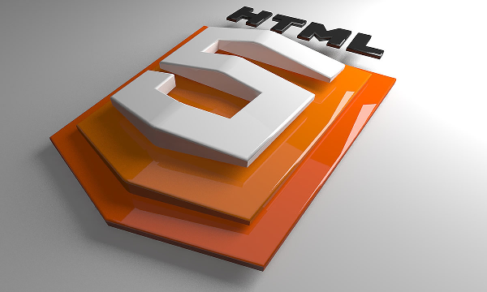

*ENGLISH*


# :book: Jon Mircha course: responsive design & CSS arquitecture

You can see the video [here](https://www.youtube.com/watch?v=udGrXWeJp1Y&list=PLvq-jIkSeTUZYcX9SYwVe7f66afwd9qk_&index=5)

## Tech Stack 🛠️

**HTML5** & **CSS3**


[You can take a look of the proyect here.](https://eugenia1984.github.io/responsive-arquitectura/)


# Please: 🎁

- Shared this content with others 📢

- Invite a beer 🍺 or a coffee ☕ to someone from the team

- Thank you very much 🤓.

- Notes: 

I appreciate your interest in this repository ⌨️ with ❤️ by [María Eugenia Cost](https://github.com/eugenia1984) a 😊 and follow me on [LinkedIn](https://www.linkedin.com/in/mar%C3%ADaeugeniacosta/)


---


*ESPAÑOL*

# :book: Curso de Jon Mircha : diseño responsivo y arquitectura CSS

Podés ver el vidoe de Jon [acá](https://www.youtube.com/watch?v=udGrXWeJp1Y&list=PLvq-jIkSeTUZYcX9SYwVe7f66afwd9qk_&index=5)

## Stack teconológico 🛠️

**HTML5** y **CSS3**

[Podés ver el proyecto del curso acá](https://eugenia1984.github.io/responsive-arquitectura/)

## Por favor: 🎁

- Compartí este contenido con otros 📢

- Invita una cerveza 🍺 o un café ☕ a alguien del equipo

- Muchas gracias 🤓.

## Notas: 

Aprecio tu interés por este repositorio ⌨️ con ❤️ de [María Eugenia Cost](https://github.com/eugenia1984)  😊 y seguime en [LinkedIn](https://www.linkedin.com/in/mar%C3%ADaeugeniacosta/)

---

# Acá voy a ir dejando notas de la teoría

## Un poco de historia

- En 1998 teníamos a **WML** ( Wireless Markup Languaje ) y a **WPA** ( Wireless Application Protocol) como protocolos que permiten visualizar el contenido, son hermanos de xml y html. Salen los primeros celulares.

- WML se vuelve el standar, pero luego WML y WPa quedan obsoletos porque en el 2007 nace el **iphone** y *Steve Jobs* marca el standard a seguir en disositivos móbiles, tienen Safari integrado y todo un ecosistema (luego por cuestiones economicas sale el app store).

- En 2008 la w3c crea la **mobile web initiative**. En 2008-2009 sale **HTML5**.

- En 2010 *Ethan Marcotte* crea el concepto de **responsive design**, lo publica en un blog y luego lo edita en un libro (2011).


## Responsive design

**Grid Flexibles**: la reticula debe fluir y adaptarse al dispositivo, como por ejemplo el patrón de tener 1 columna para mobil, 2 columnas para tables y 3 comunas para pantalla desktop.

**Imagenes Flexibles**: que fluyan de acuerdo al tamaño del contenedor, aunque físicamente sean más grandes se adaptan. Esto también aplica para: videos, iframes, post, mapas, videos; todos los elementos multimedia.

**Media Queries**: el aliado número uno, con condicionales se van definiendo estilos para deteminadas medidas o formatos.


## No es solo adaptar el contenido de la pantalla, también es considerar...


... **conexión de red**: wi-fi, 2G, 3G, 4G, 5G.

... **hardware** y **software** de los dispositivos: Sistema Operativo, versiones, memoria, procesador, sensores, etc.

... **interacciones**: con el teclado y mouse, táctiles, por voz, etc.

... **accesibilidad web** : soporte a discapacidades.

Y además de los celulares, hoy en día hay: bands, smart watches, sensores para correr, anillos, google glass, etc.


## Estrategias de Diseño Multidispositivos

[Responsive Design](http://alistapart.com/article/responsive-web-design/) con Ethan Marcott en 2010.

[Adaptive Design](https://blog.easy-designs.net/archives/on-adaptive-vs-responsive-web-design/) con Aaron Gustafson en 2011.

[Responsive + Server Side - RESS](https://www.lukew.com/ff/entry.asp?1392) con Luke Wroblewski en 2011. Las interfaces se mandan a llamar desde un Back End.

[Responsible Responsive Design](https://abookapart.com/products/responsible-responsive-design) con Scott Jehl en 2014. Agrega buenas prácticas de JavaScript para mejorar el performance.

[Fluid Design](https://utopia.fyi/) con Trys Mudford en 2020. Diseño más minimalista, los sitios fluidos utilizando poca media querie, haciendo que fluya la tipografía, el tamaño de los contenedores, los grids. Creo **Sergei Cool**, el static template agnóstico (solo HTML 5 y CSS3).

Más información [Diseño Web en la Era Móvil](https://www.iconos.edu.mx/qrtesis/140171MV.html) la tesis de Jon Mircha.

---

## Contenedores Flexibles

antes se trabajaba con medida fijas (px), pero luego al tener más tamaños de pantalla se comenzó a trabajar con medidas responsivas, como **em** o **rem**.

---

## Multimedia flexible

img, audio, video, iframe, canvas, svg, picture, object, embed, map, area.

En el Responsive Design la multimedia debe ser flexible y adaptarse al tamaño de su contenedor, lo podemos lograr con las siguiente regla CSS:

```CSS
img, audio, video, iframe, canvas, svg, picture {
          max-width:100%;
          height: auto;
        }
```

### Imagenes

**Atributo srcset y sizes**: para mejorar el rendimiento de carga, al colocar la misma imagen pero en diferentes tamaños y pesos, dependiendo del tamaño o la resolución de la pantalla.

Ejemplo en código:

```html

```

Para este segundo caso, si se carga la imagen del tamaño más grande no se va a ver la responsividad, pero si se carga del tamaño más pequeño si se nota.

Utilizando el atributo **srcset**. Ejemplo en código:

```html
 
```

Utilizando el atributo **srcset** y **sizes**. Ejemplo en código:

```html
  
```

Muchas plantillas de WordPress lo utilizan, internamente genera varios tamaños de la imagen que subo, genera entre 3 a 5 tamaños, para dependiendo de la resolucion del Theme se utilizan los atributos srcset y sizes.


**Etiqueta picture**: para mostrar diferentes tamaños de la misma imagen, y también mostrar imágenes diferentes. Por ejemplo, recortar una Imagen de forma diferente según el tamaño de la pantalla y las diferencias en el diseño. Esto se conoce como "dirección de arte".

Esto se ve en los sitios que tiene una version minificada de su logo, entoences acorde al tamaño se ve un logo u otro.

Para los navegadores que no soportan la etiqueta **picture** utilizamos al etiqueta **img** con la imagen más pequeña.

Ejemplo en código:

```html
<picture>
  <source srcset="img/kitten-large.png" media="(min-width: 1024px)">
  <source srcset="img/kitten-medium.png" media="(min-width: 600px)">
  
</picture>
```

Pero también tenemos un nuevo tipo de formato **webp**, propuesto por Google, es una mejor solución de imagen para los jpg y gif animados.

```htlm
<picture>
  <source srcset="img/butterfly.webp" type="image/webp"> 
  
</picture>
```

### Videos

La forma más clásica de hacerlo responsivo, es con las propiedades:

```CSS
max-width: 100%;
height: auto;
````

Otro modo es utilizando la propiedad **aspect-ratio**.

## Media Queries

Se definen con el formato de la versión 2 con la etiqueta **link**. Por ejemplo, en el **header**:

```html
 <link rel="stylesheet" media="print" href="css/print.css">
```

Y en el css:

```css
@page {
  size: A4;
}

body {
  font-size: 12pt; 
  font-family: serif;
  background-color: #000;
  color: #fff;
}
```

Se usa puntos -pt- porque se imprime con el software de Microsoft Word que trabaja con pt como medida

- Otro modo es con el **css** con las **@media**

Ademá de las clásicas media queries acorde a la medida de las pantallas, como los de las librerias o frameworks,  como las de Bootstrap que tienen por ejemplo: 

Para los diseños MOBILE FIRST
```
@media screen and (min-width: 480px) {...}
```

Para los diseños DESKTOP FIRST
```
@media screen and (max-width: 1024px) {...}
```

Si se empezo un diseño Mobile First no combinar con el diseño Desktop First sino puede haber inconveniente con los estilos, si se usa min-width al principio usar ese y no el max-width.

Y hay otras menos conocidas, como por ejemplo:

- @media print , para impresion

- @media screen and (prefers-reduced-motion: reduce) { } , para inhabilitar el scroll-behavior: smooth;

- @media screen and (prefers-color-scheme: dark) { }, para hacer el efecto dark

- @media screen and (prefers-color-scheme: light) { }, para hacer el efecto light

---

## Breakpoints

Están relacionados con las **media queries**, son los puntos de quiebre para determinar que determinado estilo se va a plicar en determinado tiempo, por ejemplo acorde al ancho de la pantalla, si es mobil lo puedo ver de un modo, si es tablet de otro y si es desktop de ootr, si le puse 2 breakpoints.

En el libro de Ethan Marcot ya nos sugería unas medidas para el responsive design:

320px para dispositivos con pantallas pequeñas. como los telefonos en modo vertical

480px para los dispositivos con pantallas pequeñas, como los telefonos en modo horizontal; o los mobiles de gama alta en modo vertical.

600px para tablas pequeñas. como el kindle

768px para tabletas de diez pulgadas como el iPad, en modo vertical

1024px para tablets como el iPad en modo horizontal

1200px para pantallas panorámicas, como laptops o desktops.

En general por más que tenga una pantalla de 1900px, se suele dejar el contenedor a 1200px, para que no tengamos la mala experiencia en la lectura que tengamos que ir moviendonos de un lado para el otro, si se le podria aplicar el maximo de ancho a la hero-image o a algún mensaje que quiera llamar la atención, se le puede poner una imagen de fondo la 100% y el contenido igual que llegue a los 1200px.

El standard de hoy van de 1200px a 1500px.

Hay sitios que suelen aprovechar el 100% de la pantalla, como las páginas de documentaciones, porque suelen tener en la columna izquierda como un indice, en el medio su contenido y en una columna de la derecha algun resumen o algo que quieran destacar.


Muy importante **conviete tus breakpoints en pxs a ems**, ya que los pixeles son en medidas absolutas y las computadoras que tiene mayor densidad de pixeles y no se visualizan correctamente. Asi es todo relativo la contenedor en el que está.


Objetivo en pixeles / Contexto en pixeles = Resultado en **Ems** : 

- 320px / 16px = 20em

- 480px / 16px = 30em

- 600px / 16px = 37.5em

- 768px / 16px = 48em

- 1024px / 16px = 64em

- 1200px / 16px = 75em

---

## Viewport

Es una etiqueta que la introdujo Apple, en SAfari para mejorar la presentación de los dispositivos como el iPhone, iPod Touch o iPad.

La etiqueta **viewport** es el área visible de nuestro navegador y permite definir el ancho, alto y escala del area usada por el navegador para mostrrar su contenido.

Tiene 6 atributos importantes:

**width**: define el ancho visible, suele usarse la constante device-width para que se adapte al ancho del dispositivo.

**height**: define el alto visible, suele usarse la constante device-height para que se adapte al alto del dispositivo.

**initial-scale**: define la escala inicial a la que deberá visualizarse el contenido, siendo 1 el 100%.

**minimus-scale**: define la escala mínima a la que se podrá hacer zoom al contenido, por ejemplo si se configura .5 significa que se podrá hacer un zoom de hasta el 50%. Para controlar hasta donde el usuario hace zoom, para que no se rompa la maquetacion.

**maximum-scale**: define la escala máxima a la que se podrá hacer zoom al contenido, por ejemplo si se configura 3 significa que se podrá hacer un zoom de hasta el 300%.

**user-scalable**: define si el usuario puede escalar o no el contenido, sus valores son *yes* por defecto y *no* para bloquear esta propiedad. Es una propiedad booleana. 

Al ponerle no impido que el usuario haga zoom in o zoom out, pero el usuario final está por sobre todos y su interacción es lo más importante, y si le saco el zoom, en un celular no van a poder ampliar la pantalla, lo cual va a ser un inconveniente para alguien con alguna discapacidad visual, lo cual es malo en cuanto a la experiencia de usuario.

Si es por ejemplo un e-comerce, si le sacas el zoom, podes perder al cliente.

El **width** e **initial-scale** son muy importantes para que el contenido se adapte al tamaño del dispositivo.


Separados por **coma** puedo utilizar más de un viewport.

---

## Responsive Grid

Como los Framework de Bootstrap y Foundation tienen las 12 columnas.

El primero de todos fue 960 grid system, centraba el sitio a 960 px y dejaba margen derecho e izquierdo para llegar a los 1024px. En este caso usaban 16 y 12, que eran multiples muy fáciles para dividir en columnas. Y al final se quedaron con las **12 columnas**.

---

